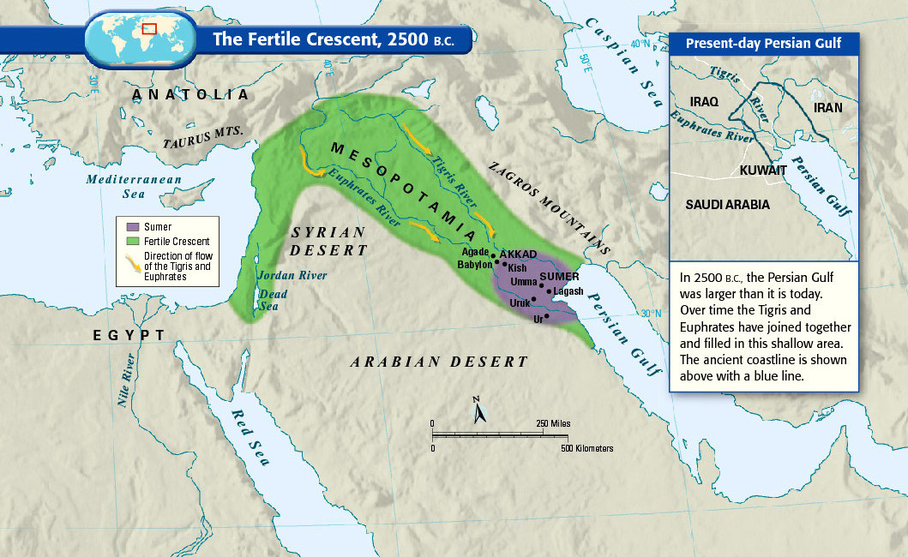
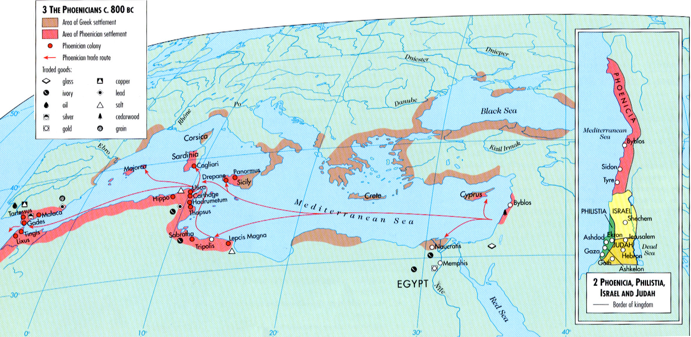
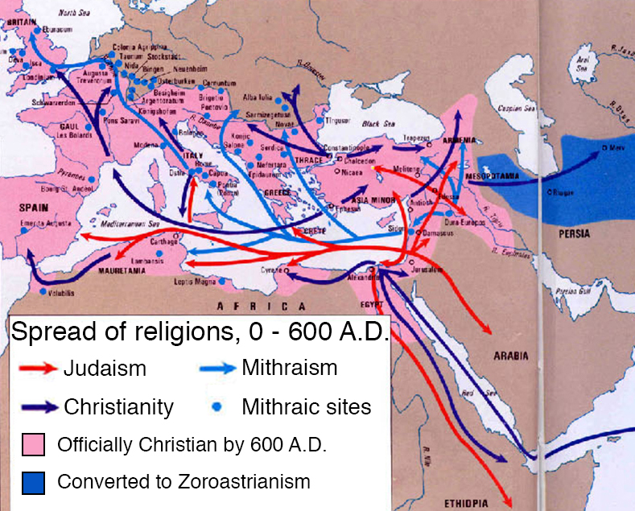

# 40张地图带你了解中东

[Original link](https://www.vox.com/a/maps-explain-the-middle-east)

中东历史

## 1. 新月沃土，文明的摇篮

如果这儿不是人类文明的起源，至少也是发源地之一。因肥沃的土地被称为“新月沃土”， 新月状的土地包括了今日的伊拉克，叙利亚，约旦以及以色列-巴勒斯坦地区（一些定义中也会包含埃及的尼罗河谷地区）。人类早在公元前9000年左右就在这儿从事农业生产。公元前2500年苏美尔人建立了第一个复杂社会，类似于我们今日所称的“国家”，并且颁布了一系列有文字记录的法律以及形成了行政系统。一个有意思的事实：罗马文明距离苏美尔文明的时间甚至长于我们距离落马文明的时间。

## 古腓尼基人：从黎巴嫩走向地中海

腓尼基人生活在今日的黎巴嫩和叙利亚沿海地区。从公元前1500年至公元前300年，他们经营着地中海地区最大的商业网络（如图所示红色地区），以及同希腊人一起主宰者这篇海域（如图所示棕色地区）。一些腓尼基人最远曾经航行到大不列颠岛。他们在北非，西班牙，西西里岛和萨丁岛都建立过殖民地。腓尼基人在中东和北非的不同文明之间建立了交流的纽带。今天利比亚的首都的里波里任然保留着腓尼基时期的名字。

## 新的信仰的孕育

中东地区曾经给欧洲带来过四次宗教信仰，包括伊斯兰教。这张地图展示了前三次。第一次是犹太教。在公元一世纪和二世纪，犹太教在罗马人强制驱散叛乱的以色列人时传播开来。公元一世纪到三世纪，一种称为密特拉教的宗教从今日的土耳其或亚美尼亚传播至罗马（那个时候，大多数信徒认为它源自波斯，也就是今日的伊朗，但这大概是错误的认知）。密特拉教又是也被称为神秘信仰，它以秘密的神社和神秘的崇拜为特征。密特拉教在之后被基督教完全取代，后者成为了罗马帝国的国教。一个不为人知的事实是：基督教在几个世纪之间都是中东地区最主要的宗教。

